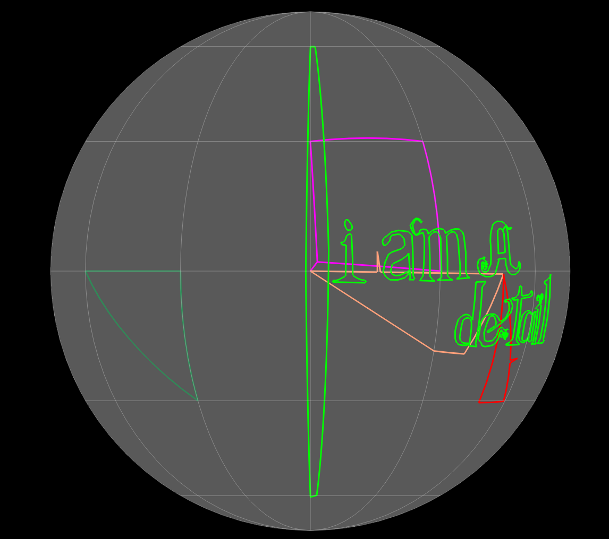
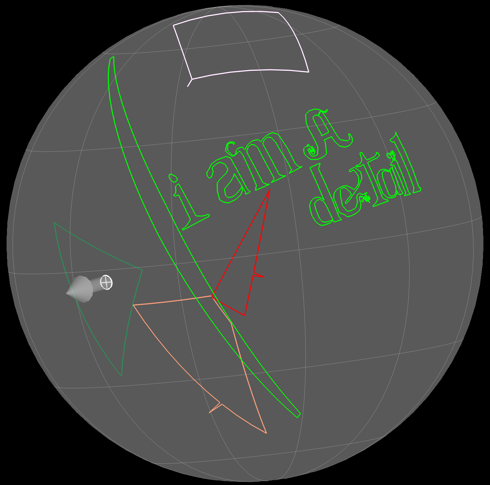

<p align="center">
    <h1 align="center">GPML</h1>
    <h3 align="center">Convert vectors in GPlates to vectors in SVGs from your terminal program.</h3>
</p>

<table border="0">
    <tr align="center">
        <td>
        Feature in GPlates<br/> at beginning of simulation
        </img>
        </td>
        <td>Feature in the generated SVG
        </img>
        </td>
    </tr>
    <tr align="center">
      <td colspan=2><a href="./documentationAssets/testPlanet1000.svg">Link to 1000 Ma svg</a></td>
    </tr>
      <tr align="center">
        <td>
        Feature in GPlates<br/> after transformations
        </img>
        </td>
        <td>Feature in the generated SVG
        </img>
        </td>
    </tr>
    <tr align="center">
      <td colspan=2><a href="./documentationAssets/testPlanet700.svg">Link to 700 Ma svg</a></td>
    </tr>
    <tr>
      <td>
        The details stay fairly true in rotation and close up. Unlike GPlates, vectors in the files are translated as straight lines in the SVG.
      </td>
      <td></img></td>
    </tr>
</table>

GPML-to-SVG is currently in **alpha**. You can get useful results if the shapes you are trying to convert are `SHAPES` according to GPlates and not lines or dots. _Continental Crust_ and _Ocean Crust_ are safe bets.

### System requirement
- Node 20 or higher

Node is a javascript runtime that is compatible with the major operating systems. You do not need to know Node to use this command line tool.

[How to install Node](https://nodejs.org/en/learn/getting-started/how-to-install-nodejs) 


## How to:
Install `gpsvg` globally:

```sh
npm install gpsvg -g
```

Once it's installed test the installation by running

```sh
gpsvg --version
```

If the cli has been successfully installed you should see something like:

```sh
gpsvg --version
0.0.6
```

To run the conversion, make sure gpsvg is installed. Then pass in commands.


## Commands

GPSVG has two commands:
1. `convert` one or more files at a specific time to a rectangular projection.
2. `color-gradient` converts a single file but will apply coloring based on feature age and a `.cpt` file.

### Convert options

```sh
gpsvg convert -t 900 -d /Users/imauser/testTheCode/ -c "008080" -fn kilroyWasHere "/Users/imauser/folder\ Name/Big\ continents:dinosaur\ friendly.gpml"
```

<table>
<tr>
  <td >
  <code>convert</code>
  </td>
  <td>
    the command for converting a file or files to an SVG
  </td>
</tr>
<tr>
  <td >
  <code>-t, --time</code>
  </td>
  <td>
    the point in time you want converted, in Ma <br /><b>required</b><br />
    It will check all features and only render those that exist at this moment in the simulation.
  </td>
</tr>
<tr>
  <td >
  <code>-d</code>
  <code>--destination</code>
  </td>
  <td>
    the destination folder or directory for the generated SVG <br /><b>required</b><br />
    Add a space and then put in your full file path. If your path name contains any spaces or special characters, be sure to wrap it in quotes.
  </td>
</tr>
<tr>
  <td >
  <code>-r</code>
  </td>
  <td>
    the rotation file you wish to use <br/><i>optional</i><br/>
    The tool will attempt to find a rotation file near any of the files you pass in if you don't specify one to use.
  </td>
</tr>
<tr>
  <td >
  <code>-c, --color</code>
  </td>
  <td>
    the primary color for the output SVG. This can be a valid CSS color or a hex color. <br/><i>optional</i><br/><a href="https://www.w3schools.com/css/css_colors_hex.asp">W3C CSS colors</a><br />If you do not provide a color, everything will be rendered in gray.
  </td>
</tr>
<tr>
  <td >
  <code>-mc</code>
  </td>
  <td>
    this is a simple flag. Include it if you want different groups of features (per file) to be colored different shades of the main color. It does not take parameters.<br />
    <code>gpsvg convert -c f00 -mc -r "/Users/imauser/...</code>
  </td>
</tr>
<tr>
  <td >
  <code>-fn, --file-name</code>
  </td>
  <td>
   an optional parameter for the name of the output svg. <br/><i>optional</i><br/>If no name is provided, the CLI will ask for one during conversion
  </td>
</tr>
<tr>
  <td >
  <code>-lo, --long-offset</code>
  </td>
  <td>
   an optional parameter for offsetting the render horizontally. <br/><i>optional</i><br/>
  </td>
</tr>
<tr>
  <td >
  <code>"/Users/imauser/folder\ Name/Big\ continents:dinosaur\ friendly.gpml"</code>
  </td>
  <td>
    any files or a directory that you want to convert <br /><b>required</b><br />
    List your files with a space separating each complete path.
  </td>
</tr>
</table>

**The path or paths you want to convert *MUST* come last.**

Please note: any path with spaces **must be in quotes.**

Destination, time and a file to convert are required. If you're not passing in a directory of files, the tool will attempt to find a rotation file near any of the files you pass in, and will use the first it finds.

### Color-gradient options

```sh
gpsvg color-gradient -t 900 -d /Users/imauser/testTheCode/ -fn kilroyWasHere -cr /Users/iamuser/ocean-depth.cpt -f "/Users/imauser/folder\ Name/Big\ continents:dinosaur\ friendly.gpml"
```

<table>
<tr>
  <td >
  <code>color-gradient</code>
  </td>
  <td>
    the command for converting a file or files to an SVG
  </td>
</tr>
<tr>
  <td >
  <code>-t, --time</code>
  </td>
  <td>
    the point in time you want converted, in Ma <br /><b>required</b><br />
    It will check all features and only render those that exist at this moment in the simulation.
  </td>
</tr>
<tr>
  <td >
  <code>-d</code>
  <code>--destination</code>
  </td>
  <td>
    the destination folder or directory for the generated SVG <br /><b>required</b><br />
    Add a space and then put in your full file path. If your path name contains any spaces or special characters, be sure to wrap it in quotes.
  </td>
</tr>
<tr>
  <td >
  <code>-r</code>
  </td>
  <td>
    the rotation file you wish to use <br/><i>optional</i><br/>
    The tool will attempt to find a rotation file near any of the files you pass in if you don't specify one to use.
  </td>
</tr>
<tr>
  <td >
  <code>-cr</code>
  </td>
  <td>
    the crt file to use for coloring the features. <br /><b>required</b><br />
  </td>
</tr>
<tr>
  <td >
  <code>-fn, --file-name</code>
  </td>
  <td>
   an optional parameter for the name of the output svg. <br/><i>optional</i><br/>If no name is provided, the CLI will ask for one during conversion
  </td>
</tr>
<tr>
  <td >
  <code>-lo, --long-offset</code>
  </td>
  <td>
   an optional parameter for offsetting the render horizontally. <br/><i>optional</i><br/>
  </td>
</tr>
<tr>
  <td >
  <code>-f, --file-path</code>
  </td>
  <td>
    the file you wish to convert <br /><b>required</b><br />
    Unlike `convert` for `color-gradient` you must specify the file you want to convert.
  </td>
</tr>
</table>

Destination, time and a file to convert are required. The tool will attempt to find a rotation file near any of the files you pass in, and will use the first it finds. It will not try to find `.crt` files yet.

Please note: any path with spaces **must be in quotes.**

### Example:
FULL PATH: `/Users/imauser/folderName/Big\ continents:dinosaur\ friendly.gpml`

DESTINATION PATH: `/Users/imauser/testTheCode/`

COLOR: `teal` or `008080` or `#008080`

TIME: 900

ROTATION FILE: `/Users/imauser/folderName/shared.rot`

```sh
gpsvg convert -d /Users/imauser/testTheCode/-c "008080" -t 900 "/Users/imauser/folderName/Big\ continents:dinosaur\ friendly.gpml"
```

You can convert multiple files into one SVG.

```sh
gpsvg convert -c "008080" -t 900 -r /Users/imauser/folderName/shared.rot "/Users/imauser/folderName/Big\ continents:dinosaur\ friendly.gpml" "/Users/imauser/folderName/Big\ continents:terror\  bird.gpml"
```

or a directory.

```sh
gpsvg convert -c "008080" -t 900 -r /Users/imauser/folderName/shared.rot /Users/imauser/folderName
```

or combinations

```sh
gpsvg convert -c "008080" -t 900 -r /Users/imauser/folderName/shared.rot /Users/imauser/folderName /Users/imauser/folderName2/bigDino.gpml
```

### Limitations
As of this version (0.0.6 alpha) 
- only shapes and lines will get converted
- every file gets converted to a `<g>` group, which can be selected as a group by Illustrator

**To use local version:**
1. install Node v20.1.0 or higher: [How to install Node](https://nodejs.org/en/learn/getting-started/how-to-install-nodejs)
2. clone GPML-to-SVG locally
3. navigate into the GPML-to-SVG directory
4. run `npm install`
5. run `npm run build`
6. to run locally replace `gpsvg` with `node dist/index.js`

-----------
I don't have a PC, so if anyone is willing to test this on a PC, I would appreciate the collaboration.
